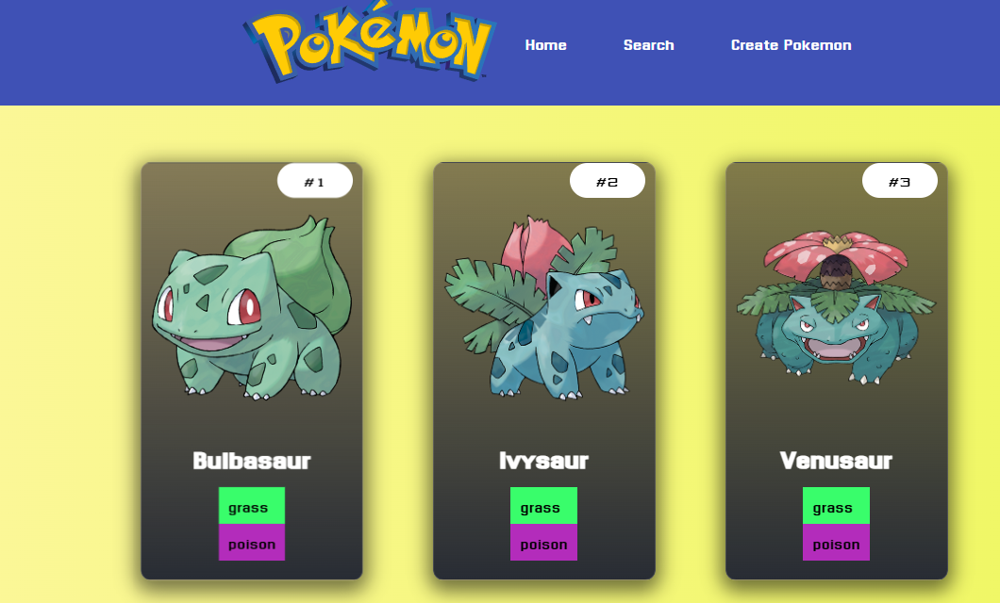

##POKEAPP

POKEAPP es una aplicación web interactiva que permite a los usuarios crear, buscar y gestionar Pokémon personalizados. Esta herramienta ofrece una experiencia única en la que los usuarios pueden asignar características específicas a cada Pokémon, como ID, nombre, tipo y más, además de buscar y visualizar Pokémon existentes en una lista interactiva.

####Tecnologías Utilizadas

**React**: Utilizado para construir la interfaz de usuario de la aplicación. React es una biblioteca de JavaScript para construir interfaces de usuario de manera eficiente y con menos código.
**Material-UI**: Una biblioteca de componentes de React para un desarrollo más rápido y fácil. Se utilizó para diseñar la interfaz de usuario con un aspecto moderno y responsivo.
**React Hook Form**: Una biblioteca para manejar formularios en React. Facilita la validación y el manejo de formularios con un rendimiento optimizado.
**Context**: Proporciona una forma de pasar datos a través del árbol de componentes sin tener que pasar props manualmente en cada nivel.
**CSS/SCSS**: Para estilos personalizados y diseño adaptativo, mejorando la experiencia del usuario en diferentes dispositivos.

####Características

- Creación de Pokémon: Los usuarios pueden crear un nuevo Pokémon proporcionando detalles como ID, nombre, tipo y una imagen.

+ Lista y Visualización de Pokémon: Cada Pokémon creado se muestra en una lista interactiva, donde los usuarios pueden ver detalles en tarjetas individuales.

- Buscador de Pokémon: Los usuarios pueden buscar Pokémon específicos en la lista utilizando diferentes criterios.

+ Gestión de Pokémon: Los usuarios pueden eliminar Pokémon individuales de la lista.

 

####Uso
Para usar la aplicación, sigue estos pasos:

1. Abre la aplicación en tu navegador.
2. Rellena el formulario para crear un nuevo Pokémon.
3. Busca y visualiza los Pokémon en la lista.
4. Elimina Pokémon según sea necesario.

####Contribuciones

Las contribuciones son bienvenidas. Si deseas contribuir, por favor:

1. Haz un _fork_ del repositorio.
2. Crea una nueva rama para tus cambios.
3. Realiza tus cambios.
4. Envía un _pull request_.

¡Gracias por la visita!

Creado por: Alejandro Marquez Andrade

GitHub: [alejandroFMA](https://github.com/alejandroFMA)
